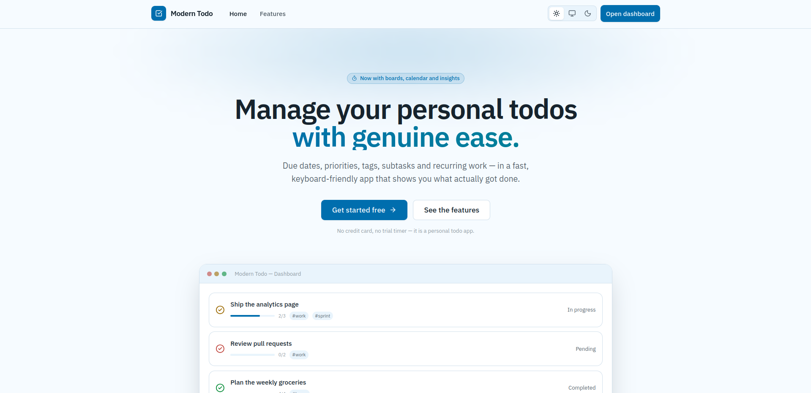
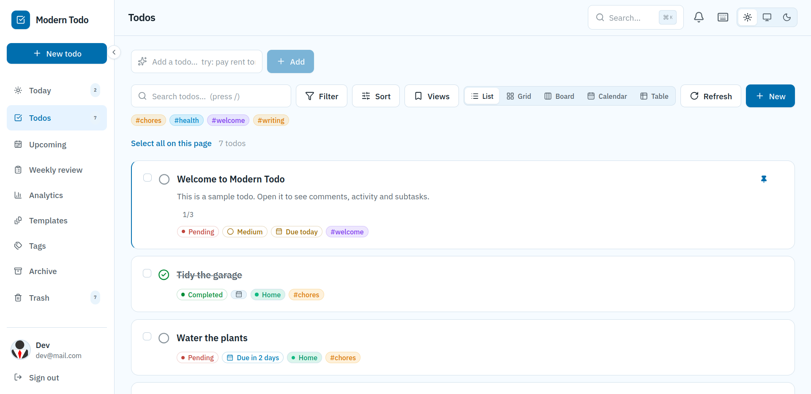
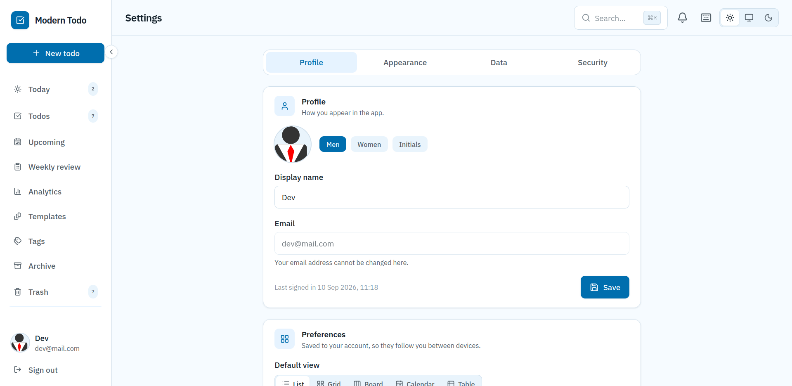

# Modern Todo

Written by [Bilal Amjad](https://github.com/Thedevelop3r). (Claude assisted)

A todo application where a todo is a **document**: it carries attachments,
formatted text, a branded printable record, and a shape that fits the industry
you work in.

It is **one Next.js project**. The UI is Next.js 14 (App Router, TypeScript,
Tailwind) and the REST API is Express + Mongoose, both served from a single
custom server on a single port. A small Rust service renders the PDFs, and it is
the only part that is not JavaScript.

**Version 2.0** — see the [changelog](CHANGELOG.md) for what is new.

### Home


### Dashboard


### Profile


## Features

**Organise** — due dates with overdue/today/soon badges · five priority levels ·
free-form tags with autocomplete · subtask checklists with progress · pinning ·
archive · duplicate · recurring todos (daily/weekly/monthly)

**Find** — full-text search across titles, descriptions and tags with highlighted
matches · combined status/priority/tag/due filters · sorting on five fields ·
filters live in the URL, so any view is a shareable link

**Act** — multi-select with bulk status, priority, tag, pin, archive and delete ·
optimistic updates with undo · trash with restore · empty trash

**Structure** — projects with their own todos and analytics · start dates and
effort estimates · a built-in timer per todo · comments · an activity trail ·
dependencies, with cycle detection and blocked todos that cannot be completed

**Reuse** — saved views · templates (create one from scratch or from an existing
todo) · a tag manager that renames, merges and deletes across every todo

**See** — list, grid, drag-and-drop board, month calendar and table views ·
today, upcoming and weekly-review pages · analytics with completion trends,
status and priority breakdowns, top tags, a contribution heatmap and a daily
streak

**Make it yours** — **50 colour themes** in three collections (men, women and
other), each with a light *and* a dark version · **any Google Font by name**,
fetched through the app itself · five text sizes · compact mode. See
[Theming and fonts](#theming-and-fonts).

**Control** — `Ctrl/Cmd+K` command palette · keyboard shortcuts (`n`, `/`, `g d`,
`?`) · installable as a PWA, and a reload works offline · a skip link, live
regions and focus management throughout

**Account** — change password with a strength meter · avatar picker ·
two-factor authentication with recovery codes · per-device sessions you can
revoke · an audit log · export and import (JSON or CSV, with a dry run) ·
rate-limited sign-in · validation shared between client and server

**Attach** — images, video, audio and documents on any todo, project or template,
plus a personal drive · streaming uploads with byte-exact progress · automatic
compression that never makes a file bigger · quotas and tiers · Range-aware
downloads, so a video seeks properly. See [Files and storage](#files-and-storage).

**Write** — Word-style formatting on titles and descriptions: bold, italic,
underline, colour, font, size, alignment, headings, lists, quotes, code and links.
Sanitised on the server against a fixed allowlist. See [Rich text](#rich-text).

**Print** — a branded, versioned PDF of any todo or project, rendered by a Rust +
Typst service, stored like any other file and listed on the record itself — with
an honest "up to date" or "changed since v3". See [PDF documents](#pdf-documents).

**Fit your work** — run the app as **General, School, Law Enforcement, Hospital or
Restaurant**. Each has its own vocabulary, its own fields and its own pages —
a gradebook, an evidence trail, a shift handover, an order sheet. See
[Application types](#application-types).

## Architecture

```
node server.js
     │
     ├── /api/*   →  Express app (server/)      — auth, todos, projects, files, PDFs, account
     ├── /*       →  Next.js handler (src/app/) — pages, assets, HMR
     │
     └── spawns   →  services/pdf (Rust)        — 127.0.0.1:8787, renders PDFs
```

Pages and API share an origin, so there is no CORS layer and the JWT session
cookie is a plain same-site `HttpOnly` cookie. The browser calls the API with
relative paths — nothing has a hardcoded host or port.

The PDF renderer is a child process of the server, not a supervised service:
`server.js` already owns the lifecycle, so it owns the renderer's too. It binds
loopback only and is never reachable from outside the container. Setting
`PDF_SERVICE_SPAWN=0` and pointing `PDF_SERVICE_URL` elsewhere is the entire
difference between "in this container" and "its own service" — see
[`example-seperate-service-internal-network-only.txt`](example-seperate-service-internal-network-only.txt).

## Layout

```
server.js              custom server: connects to MongoDB, prepares Next, mounts Express at /api,
                       spawns the PDF renderer
server/                the API
  app.js               Express sub-app (helmet, cookies, parsing, logging, errors)
  config/              storage tiers and caps; the application-type registry loader
  routes/              user, todo, trash, stats, project, library, account, font, file
  controller/          all Mongoose access (including files, storage and PDFs)
  models/              User, Todo, Trash, Project, Comment, Activity, SavedView,
                       Template, AuditLog, StoredFile, GeneratedPdf
  services/            compression, upload progress, the boot sweep, the PDF client
  middleware/          auth, validate, rate-limit, logger, error handler
  utils/               GridFS, magic-byte typing, the HTML sanitiser, rich-text helpers
  validation/          zod schemas — the CommonJS mirror of src/lib/validation.ts
  __tests__/           API test suite
services/pdf/          the Rust renderer (Cargo, not npm)
  src/                 HTTP + auth, the request contract, markup, rendering
  templates/           common.typ plus one .typ per application type
  fonts/               the faces baked into the binary
src/
  app/                 pages
  app/themes.css       generated — the 50 palettes (never edit by hand)
  components/ui/       the design system
  components/todo/     cards, board, calendar, filters, charts, PDF versions
  components/files/    uploader, grid, previews, quota meter
  components/variant/  the one generic renderer for application-type fields
  hooks/               data + filter + keyboard hooks
  lib/                 api client, helpers, validation, dates, themes, variants
shared/                data both halves read: themes.json, google-fonts.json, variants/
scripts/               generators for the icons, the themes, the fonts and the variants
```

## Theming and fonts

### 50 themes

Every colour in the app is a semantic CSS variable — `--bg`, `--surface`,
`--primary`, `--fg-muted` and so on — mapped into Tailwind as
`rgb(var(--token) / <alpha-value>)`. A theme is nothing more than a different set
of values for those same variables, which is why adding fifty of them changed no
component at all.

`shared/themes.json` holds one compact **seed** per theme (three hues, two chroma
amounts, a default font and a collection). `npm run themes` expands each seed into
a light and a dark block:

```css
[data-theme="rose-quartz"]      { --bg: 255 248 251; --primary: 168 56 118; … }
.dark[data-theme="rose-quartz"] { --bg:  21  7  14; --primary: 234 136 184; … }
```

Colours are computed in **OKLCH**, so one lightness ramp reads the same across
every hue, and the generator **fails the build** if a theme misses its contrast
floors (7:1 for body text, 4.5:1 for muted text and button labels). An
unreadable theme cannot ship. Status and priority hues are deliberately fixed
across all fifty — red, amber and green identify state on every badge in the app,
and a theme must not turn an encoding into decoration.

Theme and light/dark are **orthogonal**: the theme picks the personality, the
topbar toggle picks the mode, and every theme has both. Pick one under
**Settings → Appearance**.

> `src/app/themes.css` and `src/lib/themes.generated.ts` are generated. Edit
> `shared/themes.json` and run `npm run themes` instead.

### Any Google Font, by name

Type a family name in **Settings → Appearance** and it is applied. Suggestions
come from a committed list of every Google family, but the field is not limited
to it — any correctly spelled name is checked against Google and used.

Fonts are **proxied, not linked**. The app's Content-Security-Policy is
`font-src 'self'`, so the browser cannot reach `fonts.googleapis.com` or
`fonts.gstatic.com` at all. Instead the API fetches the stylesheet, rewrites every
font URL to one of its own, and serves the files itself:

```
browser → GET /api/fonts/css?family=Sora
            → server fetches fonts.googleapis.com
            → rewrites gstatic URLs to /api/fonts/file/<id>
browser → GET /api/fonts/file/<id>
            → server fetches and caches the woff2
```

Three things follow: the CSP stays shut, the service worker caches the files like
any other same-origin request so a chosen font still works offline, and no user's
browser ever makes a request to Google. `/api/fonts/file/:id` takes an opaque id
rather than a URL — ids exist only after parsing a stylesheet Google sent us,
which is what keeps the endpoint from being turned into a proxy for anything else.

Inter and JetBrains Mono are self-hosted by `next/font` and remain the defaults.

## Files and storage

Files live in **one GridFS bucket**, addressed through a `StoredFile` record —
quota, ownership and lifecycle live there, so nothing in the app ever queries the
bucket directly. Attach them to a todo, a project or a template, or keep them in
the personal drive at **Files**.

Four things are worth knowing:

- **Nothing is buffered.** An upload is streamed to a temp file, identified, then
  streamed into the bucket. A 250 MB upload grows the process by about 26 MB.
- **The bytes decide what a file is**, never the browser's `Content-Type`. The
  extension is rebuilt from the detected type, and anything outside the allowlist
  is refused.
- **Compression is best-effort and honest.** `sharp`, `ffmpeg` and `qpdf` are
  probed at runtime; a machine without one simply stores the original. It never
  fails an upload, never makes a file larger, and records *why* when it does not
  apply — a silent fallback is indistinguishable from compression never running.
- **Progress is real.** One SSE stream per tab carries byte-exact upload and
  storage progress. Tools that report nothing show a sliding band rather than an
  invented percentage.

Quotas are enforced by a reserve / reconcile / release cycle, with the quota
comparison inside the same atomic update that increments the counter — which is
what stops two concurrent uploads both fitting into the same free space. Tiers are
self-serve for now; billing is not wired up.

## Rich text

Titles and descriptions are stored as a **pair**: sanitised HTML and a plaintext
mirror. Four rules hold it together:

1. **Sanitising happens on the server, on write.** The client never sanitises; a
   second copy would suggest its version counted.
2. **The mirror is derived in exactly one place**, which is what search, CSV
   export and quick add read.
3. **When both halves arrive, the markup wins** — otherwise a client could pair
   real HTML with a forged mirror and poison what search sees.
4. **Titles take inline marks only.** A title renders inside one-line cells in the
   table view, the command palette and search results, so headings and lists are
   flattened there.

`style` is allowed but every *value* is validated — a hex or named colour, a
unit-bearing size, a plain family list, one of four alignments — and the allowed
class list is four alignment classes, so a paste cannot borrow the app's own
chrome to impersonate it.

## PDF documents

Any todo or project can be rendered to a branded PDF, versioned, and kept beside
the record that produced it. The renderer is a small **Rust service** (Axum +
Typst) that the Node server spawns as a child process.

It is deliberately the dumbest component in the system: **no database, no
filesystem outside its own binary, no URLs**. Everything it needs arrives in one
JSON body — and it never sees HTML, because the sanitised markup is converted to a
closed tree of nodes first. That keeps an HTML parser, and therefore
attacker-controlled markup, out of the renderer entirely. Its fonts are baked into
the binary, so a document does not depend on what the host happens to have
installed.

On the versioning side:

- Version numbers are allocated **atomically**, so two clicks a moment apart can
  never both produce a `v4`.
- A deleted version **never has its number reused** — a file already in someone's
  downloads folder stays unambiguous.
- Filenames sort naturally and say what they came from:
  `TODO-6f3a1b-v03-20260912-1430-quarterly-safety-review.pdf`.
- The list says **"Up to date with the current todo"** or **"changed since v3"**,
  computed from a hash of the content that went into the render rather than
  guessed from timestamps.
- The document uses your theme's light palette — a PDF is printed far more often
  than it is read on a screen.

Versions are never pruned automatically: keeping ten is your call, and so is
losing one.

> PDFs need the Rust binary. Without it everything else works and PDF generation
> reports itself unavailable.

## Application types

One account runs the app as **General, School, Law Enforcement, Hospital** or
**Restaurant**, chosen under **Settings → Application**. A project can override the
account's choice, so a School course can sit beside a General project.

| Type | Records are | Pages it adds |
|---|---|---|
| **General** | Todos, Projects | — |
| **School** | Assignments, Courses | Courses, Gradebook |
| **Law Enforcement** | Cases, Operations | Cases, Evidence |
| **Hospital** | Tasks, Wards | Wards, Shift handover |
| **Restaurant** | Prep, Stations | Stations, Prep list, Orders |

Exactly three things vary: the **words** on screen, the **extra fields** a record
carries, and **presentation** (icon, PDF template, suggested templates). Everything
else — the views, the filters, the shortcuts, the colours that encode status — is
identical for all five.

The rule that makes this work: **no component branches on the type.** Components
ask a registry what things are called and which fields exist, and render
generically. A type is `shared/variants/<id>.json` plus a `.typ` template, not a
patch across the codebase; pages are declared by *kind* (`group`, `scoreboard`,
`files`, `stock`) and rendered by one route.

**Switching type hides fields; it never deletes them.** Data belonging to a type
you are not using stays on the record and is listed on its detail page, so nothing
is ever lost by changing your mind.

A few things each type brings:

- **School** — weighted grades that report *no grade* rather than 0% for work that
  has not come back.
- **Law Enforcement** — a chain of custody on every stored file that **outlives the
  file**, and PDFs with a handling banner on every page plus an evidence manifest
  carrying each exhibit's checksum.
- **Hospital** — a patient *reference*, never a name, and a standing notice on
  screen and on every printed sheet: this is a task manager, not an EHR and not a
  medical device, and file reads are not audited.
- **Restaurant** — par levels and stock counts, an Orders page showing only what
  is short, and a station sheet that prints the prep list and the order it
  generates on one page.

## Requirements

**Required**

- Node.js 24+
- MongoDB (or Docker, which brings one up for you)

**Optional — each one degrades gracefully if missing**

- A Rust toolchain, to build the PDF renderer. Without it, everything else works
  and PDF generation reports itself unavailable.
- `ffmpeg` (video and audio compression) and `qpdf` (PDF compression). `sharp`
  ships its own binaries, so images are always covered. Missing tools are detected
  at startup and the original file is stored instead.

The Docker image includes all of them.

## Setup

```bash
cp .env.example .env      # then edit MONGO_URL, JWT_SECRET and PDF_SERVICE_KEY
npm install

# optional: build the PDF renderer (first build takes a few minutes)
cargo build --release --manifest-path services/pdf/Cargo.toml
```

`bcrypt` compiles a native addon; if your package manager blocks install scripts,
run `npm rebuild bcrypt` after approving it.

### Environment

| Variable | What it does |
|---|---|
| `MONGO_URL` | the only database setting the app reads — **required** |
| `JWT_SECRET` | signs session tokens — **required** |
| `PORT` / `HOSTNAME` | where the single server listens (default `3000` / `localhost`) |
| `PDF_SERVICE_KEY` | shared secret between the app and the renderer; at least 16 characters, or the renderer refuses to start |
| `PDF_SERVICE_SPAWN` | `0` to run the renderer as its own service instead of a child process |
| `PDF_SERVICE_URL` | where to find it when it is not a child process |
| `UPLOAD_TMP_DIR` | scratch space for uploads in flight — give it a volume in production |
| `DISABLE_RATE_LIMIT` | for local testing only |

## Usage

```bash
# development (hot reload)
npm run dev

# production
npm run build
npm start

# tests — the API suite, then the frontend one
npm test
npm run test:api
npm run test:web

# lint
npm run lint

# regenerate the theme CSS after editing shared/themes.json
npm run themes

# regenerate the application types after editing shared/variants/*.json
npm run variants

# refresh the bundled Google Fonts family list
npm run fonts

# the PDF renderer: build it, test it, run it by hand
cargo build --release --manifest-path services/pdf/Cargo.toml
cargo test --manifest-path services/pdf/Cargo.toml
```

The whole application — pages and API — is then on `http://localhost:3000`
(set `PORT` to change it).

## Docker & compose

```bash
# builds the app image and starts MongoDB alongside it
docker compose up --build

# compose watch mode
docker compose watch
```

The image is multi-stage: a Rust builder produces the PDF renderer, and the
runtime image adds `ffmpeg` and `qpdf` before building the app. Everything runs in
one container, with the renderer as a child process on loopback — splitting it out
later is a compose service and two environment variables, no code change.

## Tests

`npm test` runs both suites on Node's built-in test runner — no jest, no vitest
and no build step, because Node 24 strips the types itself.

The API suite runs against an in-memory MongoDB and covers auth, per-user
isolation, filtering, sorting, pagination, bulk operations, the trash round trip,
recurrence, projects, comments, dependencies, timers, export/import, 2FA, the font
proxy, stats, rate limiting, uploads and quotas, compression, the HTML sanitiser,
PDF versioning, and each application type. The frontend suite covers the pure
modules: helpers, dates, quick-add parsing, filter serialisation, validation, rich
text, the theme catalogue and the application-type registry.

```bash
npm test                                   # downloads a mongod binary on first run
MONGO_TEST_URL=mongodb://localhost:27017/todo-test npm test   # or use your own

cargo test --manifest-path services/pdf/Cargo.toml   # the renderer's own tests
```

Tests that need a tool this machine lacks (`qpdf`, or the Rust binary) **skip**
rather than fail, so a clean checkout is green with nothing extra installed.

## API

All routes are under `/api`. `/api/user/register` and `/api/user/login` are
public; everything else requires the session cookie (or an
`Authorization: Bearer <token>` header).

| Method | Path | Description |
|---|---|---|
| GET | `/api` | health check |
| POST | `/api/user/register` | create an account |
| POST | `/api/user/login` | sign in, sets the `token` cookie |
| POST | `/api/user/logout` | clears the cookie |
| GET | `/api/user/me` | current user |
| PUT | `/api/user/update` | update name / status / avatar |
| PUT | `/api/user/preferences` | theme, theme id, font, default view, page size, density, text size |
| PUT | `/api/user/password` | change password |
| GET | `/api/todo` | list — supports `page`, `limit`, `q`, `status`, `priority`, `tags`, `due`, `archived`, `pinned`, `sort`, `order` |
| POST | `/api/todo` | create |
| GET | `/api/todo/:id` | read one |
| PUT | `/api/todo/:id` | update |
| DELETE | `/api/todo/:id` | delete, moving a copy to trash |
| POST | `/api/todo/:id/duplicate` | duplicate |
| PATCH | `/api/todo/bulk` | bulk status/priority/tag/pin/archive/delete |
| PUT | `/api/todo/reorder` | persist manual order |
| GET | `/api/trash` | list trashed todos |
| PUT | `/api/trash/:id` | restore |
| DELETE | `/api/trash/:id` | delete permanently |
| DELETE | `/api/trash` | empty trash |
| GET | `/api/stats` | analytics aggregation |
| GET | `/api/tags` | tags with usage counts |
| GET/POST | `/api/project` | list / create projects (also `/:id`, `/reorder`) |
| GET/POST | `/api/todo/:id/comments` | read and add comments (edit and delete via `/api/todo/comments/:commentId`) |
| GET | `/api/todo/:id/activity` | the change trail for one todo |
| POST | `/api/todo/:id/timer/start` | start / stop a timer (`/stop`) |
| GET/POST | `/api/view` | saved views (also `/:id`) |
| GET/POST | `/api/template` | templates, plus `/from-todo` and `/:id/use` |
| PUT | `/api/tags/rename` | rename, `/merge`, or `DELETE /api/tags/:tag` |
| GET | `/api/account/export` | export the account; `/export/todos` for JSON or CSV |
| POST | `/api/account/import` | import todos, with a dry-run mode |
| GET | `/api/account/sessions` | signed-in devices; `DELETE` one or `/all` |
| POST | `/api/account/2fa/setup` | two-factor: `/enable`, `/disable` |
| GET | `/api/account/audit` | account security events |
| GET | `/api/fonts/search` | Google Fonts typeahead |
| GET | `/api/fonts/css` | a family's stylesheet, proxied and rewritten |
| GET | `/api/fonts/file/:id` | one font file, by an id the `css` route issued |
| GET/POST | `/api/files` | list files / upload one (multipart, streamed) |
| GET/HEAD | `/api/files/:id/raw` | the bytes: Range-aware, `ETag`, `?download=1` |
| DELETE | `/api/files/:id` | permanent; drops the bytes and credits the quota |
| GET | `/api/files/:id/activity` | one file's chain of custody |
| GET | `/api/files/events` | live upload and compression progress (SSE) |
| GET/PUT | `/api/files/quota` | usage and caps; `/quota/tier` changes the plan |
| GET/POST | `/api/todo/:id/pdfs` | versions, newest first / render a new one (`202`) |
| GET/DELETE | `/api/todo/:id/pdfs/:pdfId` | the bytes / delete that version for good |
| | *(`/api/project/:id/pdfs` is the same four routes)* | |

## Documentation

- [CHANGELOG.md](CHANGELOG.md) — what changed, and when.
- [CONTEXT.md](CONTEXT.md) — the architecture in depth: every decision that is not
  obvious from the code, and why it is the way it is.
- [PROGRESS.md](PROGRESS.md) — the feature ledger, batch by batch.
- [example-seperate-service-internal-network-only.txt](example-seperate-service-internal-network-only.txt)
  — running the PDF renderer as its own service.

## License

[MIT](https://choosealicense.com/licenses/mit/)

## Permission

You are free to use this code for your own projects, modify it, or publish it
anywhere. Please give me credit if you use it. (@Thedevelop3r), thanks.
