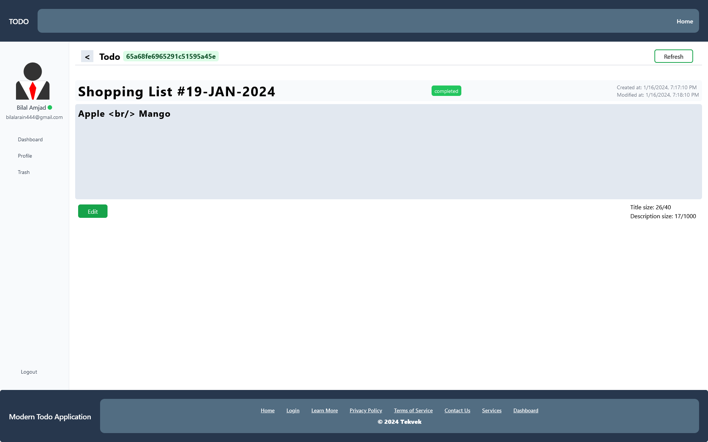
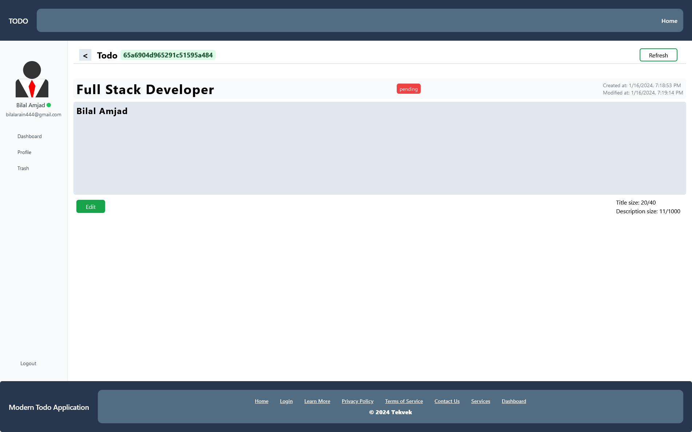

# Modern Todo

Written by [Bilal Amjad](https://github.com/Thedevelop3r).

A personal todo application — **one Next.js project**. The UI is Next.js 14 (App
Router, TypeScript, Tailwind) and the REST API is Express + Mongoose, both served
from a single custom server on a single port.


## Architecture

```
node server.js
     │
     ├── /api/*   →  Express app (server/)      — auth, todos, trash
     └── /*       →  Next.js handler (src/app/) — pages, assets, HMR
```

Because the pages and the API share an origin there is no CORS layer, and the
JWT session cookie is a plain same-site `HttpOnly` cookie. The browser calls the
API with relative paths (`/api/todo`), so nothing has a hardcoded host or port.

## Layout

```
server.js              custom server: connects to MongoDB, prepares Next, mounts Express at /api
server/                the API
  app.js               Express sub-app (helmet, cookies, body parsing, logging, error handling)
  db.config.js         DatabaseConnection wrapper around mongoose
  routes/              user, todo, trash routers
  controller/          all Mongoose access
  models/              User, Todo, Trash schemas
  middleware/          auth, request logger, error handler, 404
  wrapper/             async try/catch wrapper for route handlers
  utils/               JWT + cookie helpers, console formatting
src/                   the Next.js app
  app/                 App Router pages (landing, login, register, dashboard/*)
  components/          header/footer variants, sidebar, pagination
  store/state.tsx      Zustand store
  utils/               fetch wrappers, API paths, helpers
  types/index.d.ts     ambient shared types
```

## Requirements

- Node.js 20+
- MongoDB (or Docker, which brings one up for you)

## Setup

```bash
cp .env.example .env      # then edit MONGO_URL and JWT_SECRET
npm install
```

`bcrypt` compiles a native addon; if your package manager blocks install scripts,
run `npm rebuild bcrypt` after approving it.

## Usage

```bash
# development (Next.js in dev mode, hot reload)
npm run dev

# production
npm run build
npm start

# lint
npm run lint
```

The whole application — pages and API — is then on `http://localhost:3000`
(set `PORT` to change it).

## Docker & compose

```bash
# builds the app image and starts MongoDB alongside it
docker compose up --build

# compose watch mode
docker compose watch
```

## API

All routes are under `/api`. `/api/user/register` and `/api/user/login` are
public; everything else requires the session cookie (or an
`Authorization: Bearer <token>` header).

| Method | Path | Description |
|---|---|---|
| GET | `/api` | health check |
| POST | `/api/user/register` | create an account |
| POST | `/api/user/login` | sign in, sets the `token` cookie |
| POST | `/api/user/logout` | clears the cookie |
| GET | `/api/user/me` | current user |
| PUT | `/api/user/update` | update name / status |
| GET | `/api/todo?page=&limit=` | list own todos |
| POST | `/api/todo` | create |
| GET | `/api/todo/:id` | read one |
| PUT | `/api/todo/:id` | update title / description / status |
| DELETE | `/api/todo/:id` | delete, moving a copy to trash |
| GET | `/api/trash?page=&limit=` | list trashed todos |
| GET | `/api/trash/:id` | read one |
| PUT | `/api/trash/:id` | recover back into todos |
| DELETE | `/api/trash/:id` | delete permanently |

## License

[MIT](https://choosealicense.com/licenses/mit/)

## Permission

You are free to use this code for your own projects, modify it, or publish it
anywhere. Please give me credit if you use it. (@Thedevelop3r), thanks.

## Images

### home


### dashboard


### create todo


### edit todo


### register


### login


### profile


### todo





### trash


