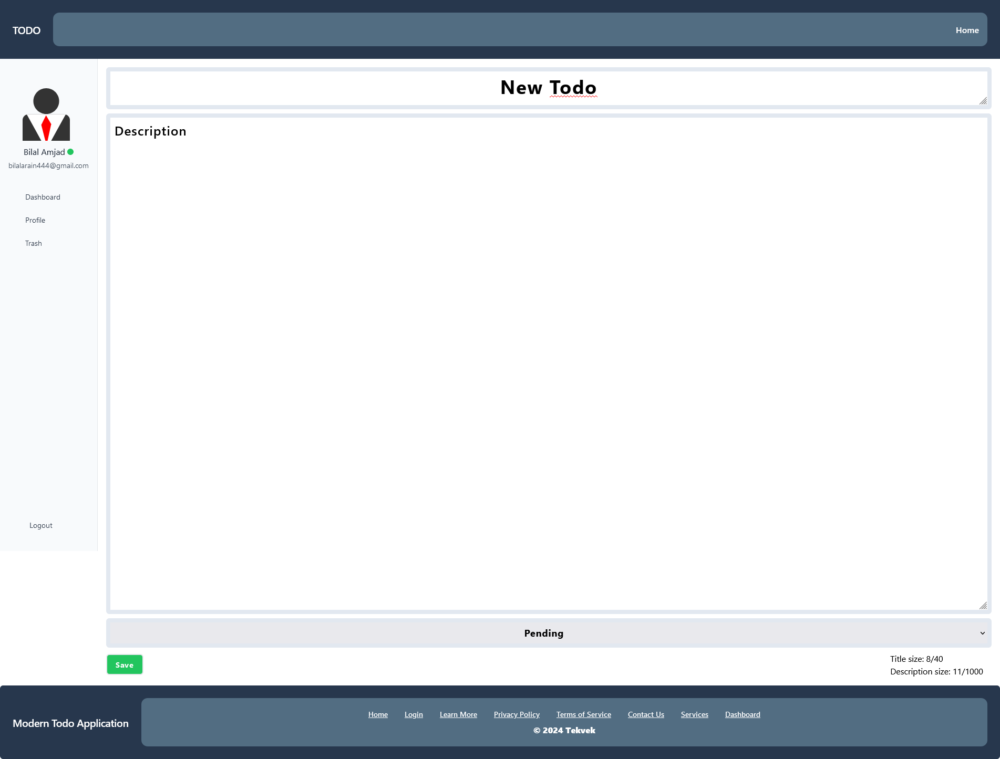
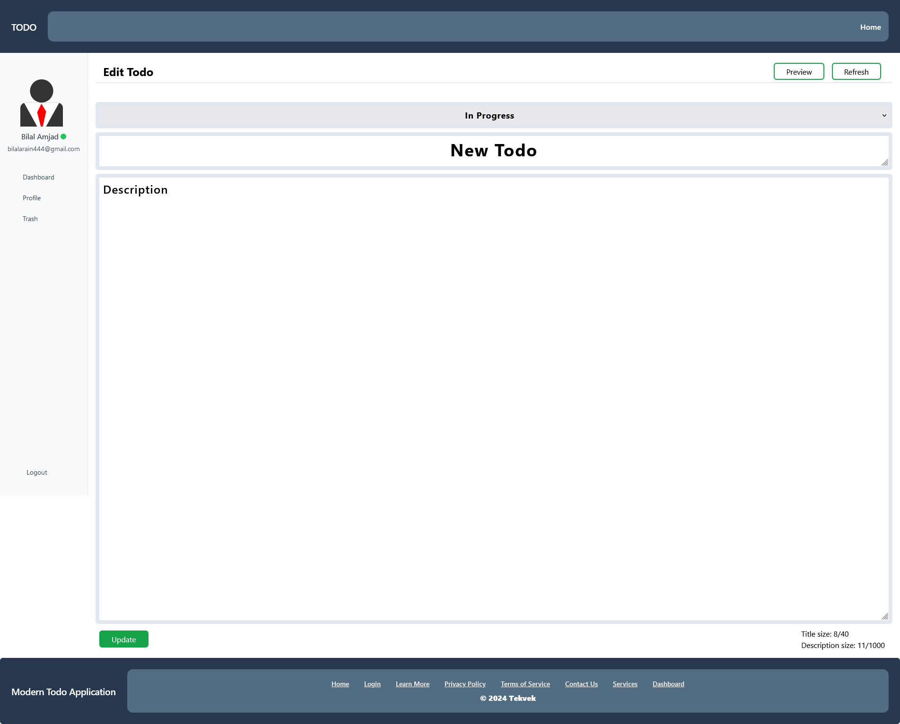
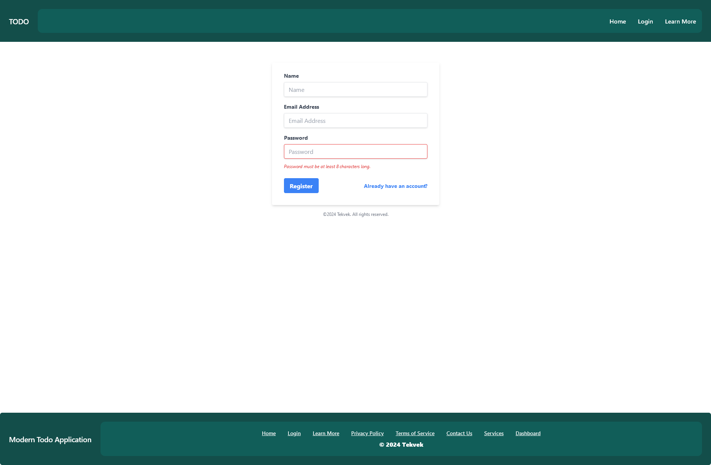
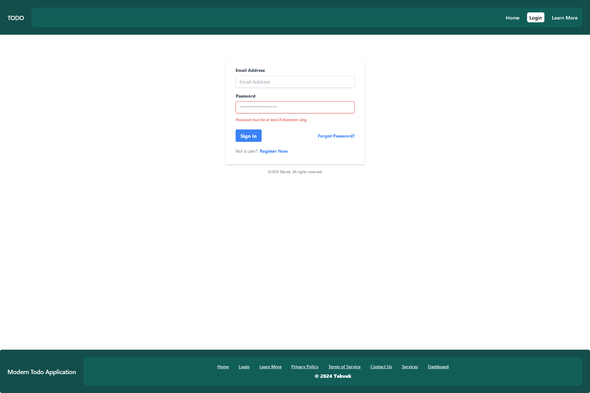
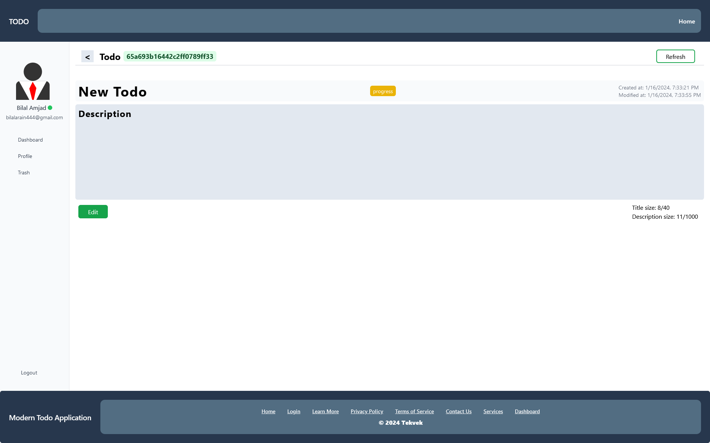
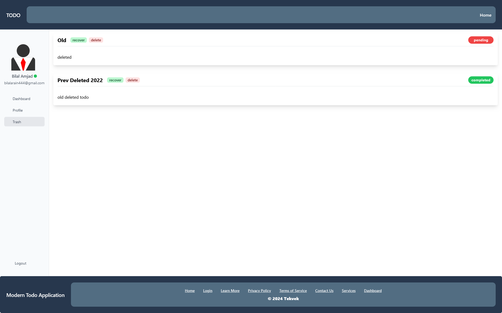

# Modern Todo

Written by [Bilal Amjad](https://github.com/Thedevelop3r).

A personal todo application — **one Next.js project**. The UI is Next.js 14 (App
Router, TypeScript, Tailwind) and the REST API is Express + Mongoose, both served
from a single custom server on a single port.


## Features

**Organise** — due dates with overdue/today/soon badges · five priority levels ·
free-form tags with autocomplete · subtask checklists with progress · pinning ·
archive · duplicate · recurring todos (daily/weekly/monthly)

**Find** — full-text search across titles, descriptions and tags with highlighted
matches · combined status/priority/tag/due filters · sorting on five fields ·
filters live in the URL, so any view is a shareable link

**Act** — multi-select with bulk status, priority, tag, pin, archive and delete ·
optimistic updates with undo · trash with restore · empty trash

**See** — list, grid, drag-and-drop board and month calendar views · analytics
with completion trends, status and priority breakdowns, top tags and a daily
streak

**Control** — `Ctrl/Cmd+K` command palette · keyboard shortcuts (`n`, `/`, `g d`,
`?`) · dark mode · saved preferences (theme, default view, page size, density)

**Account** — change password with a strength meter · avatar picker ·
rate-limited sign-in · validation shared between client and server

## Architecture

```
node server.js
     │
     ├── /api/*   →  Express app (server/)      — auth, todos, trash, stats
     └── /*       →  Next.js handler (src/app/) — pages, assets, HMR
```

Pages and API share an origin, so there is no CORS layer and the JWT session
cookie is a plain same-site `HttpOnly` cookie. The browser calls the API with
relative paths — nothing has a hardcoded host or port.

## Layout

```
server.js              custom server: connects to MongoDB, prepares Next, mounts Express at /api
server/                the API
  app.js               Express sub-app (helmet, cookies, parsing, logging, errors)
  routes/              user, todo, trash, stats
  controller/          all Mongoose access
  models/              User, Todo, Trash
  middleware/          auth, validate, rate-limit, logger, error handler
  validation/          zod schemas
  __tests__/           API test suite
src/
  app/                 pages
  components/ui/       the design system
  components/todo/     cards, board, calendar, filters, charts
  hooks/               data + filter + keyboard hooks
  lib/                 api client, helpers, validation, dates
```

## Requirements

- Node.js 20+
- MongoDB (or Docker, which brings one up for you)

## Setup

```bash
cp .env.example .env      # then edit MONGO_URL and JWT_SECRET
npm install
```

`bcrypt` compiles a native addon; if your package manager blocks install scripts,
run `npm rebuild bcrypt` after approving it.

## Usage

```bash
# development (hot reload)
npm run dev

# production
npm run build
npm start

# API tests
npm test

# lint
npm run lint
```

The whole application — pages and API — is then on `http://localhost:3000`
(set `PORT` to change it).

## Docker & compose

```bash
# builds the app image and starts MongoDB alongside it
docker compose up --build

# compose watch mode
docker compose watch
```

## Tests

`npm test` runs the API suite on Node's built-in test runner against an in-memory
MongoDB, covering auth, per-user isolation, filtering, sorting, pagination,
bulk operations, the trash round trip, recurrence, stats and rate limiting.

```bash
npm test                                   # downloads a mongod binary on first run
MONGO_TEST_URL=mongodb://localhost:27017/todo-test npm test   # or use your own
```

## API

All routes are under `/api`. `/api/user/register` and `/api/user/login` are
public; everything else requires the session cookie (or an
`Authorization: Bearer <token>` header).

| Method | Path | Description |
|---|---|---|
| GET | `/api` | health check |
| POST | `/api/user/register` | create an account |
| POST | `/api/user/login` | sign in, sets the `token` cookie |
| POST | `/api/user/logout` | clears the cookie |
| GET | `/api/user/me` | current user |
| PUT | `/api/user/update` | update name / status / avatar |
| PUT | `/api/user/preferences` | theme, default view, page size, density |
| PUT | `/api/user/password` | change password |
| GET | `/api/todo` | list — supports `page`, `limit`, `q`, `status`, `priority`, `tags`, `due`, `archived`, `pinned`, `sort`, `order` |
| POST | `/api/todo` | create |
| GET | `/api/todo/:id` | read one |
| PUT | `/api/todo/:id` | update |
| DELETE | `/api/todo/:id` | delete, moving a copy to trash |
| POST | `/api/todo/:id/duplicate` | duplicate |
| PATCH | `/api/todo/bulk` | bulk status/priority/tag/pin/archive/delete |
| PUT | `/api/todo/reorder` | persist manual order |
| GET | `/api/trash` | list trashed todos |
| PUT | `/api/trash/:id` | restore |
| DELETE | `/api/trash/:id` | delete permanently |
| DELETE | `/api/trash` | empty trash |
| GET | `/api/stats` | analytics aggregation |
| GET | `/api/tags` | tags with usage counts |

## License

[MIT](https://choosealicense.com/licenses/mit/)

## Permission

You are free to use this code for your own projects, modify it, or publish it
anywhere. Please give me credit if you use it. (@Thedevelop3r), thanks.

## Images

> These screenshots predate the redesign and will be refreshed.

### home


### dashboard


### create todo



### edit todo



### register



### login



### todo



### trash


